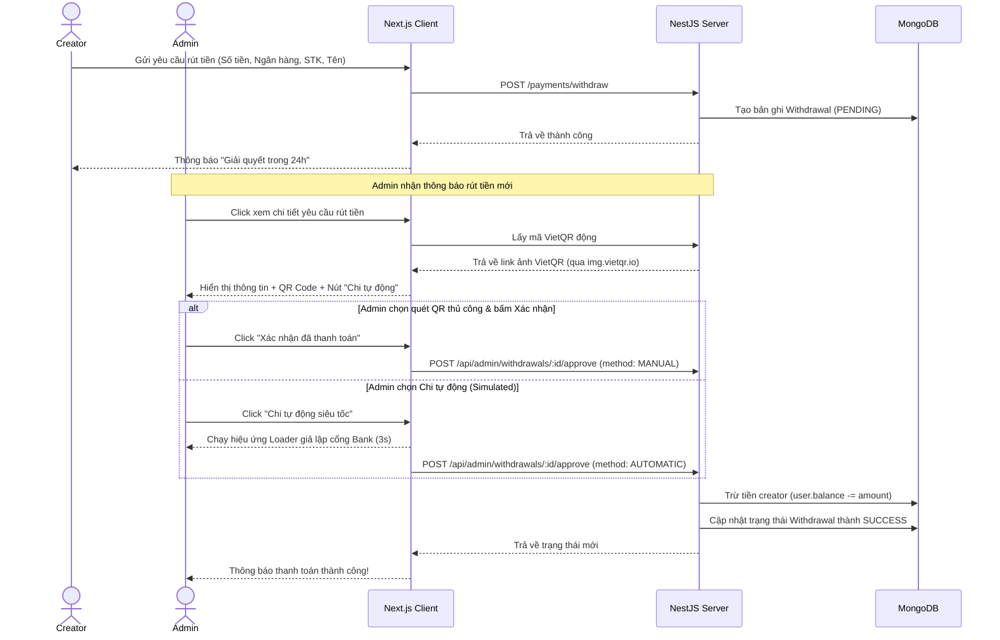

# Kế hoạch thực hiện: Chức năng Rút tiền của Creator (Creator Withdrawals)

Tài liệu này trình bày chi tiết phương án kỹ thuật và kế hoạch triển khai tính năng **Rút tiền (Withdrawal)** dành cho các Creator trên nền tảng MyTube. 

Hệ thống cho phép Creator gửi yêu cầu rút tiền về tài khoản ngân hàng của họ, đồng thời cung cấp giao diện quản trị (Admin Panel) cao cấp cho phép duyệt yêu cầu, tạo mã **VietQR** động và cung cấp cả hai phương thức thanh toán: **Thanh toán thủ công (Manual)** & **Chi tự động siêu tốc (Simulated Automated Payout)**.

---

## User Review Required

> [!IMPORTANT]
> **Về việc Trừ số dư ví ảo:**
> Để đảm bảo an toàn giao dịch, số dư ví ảo của Creator (`user.balance`) sẽ được kiểm tra hai lần (khi gửi yêu cầu và khi thanh toán). Số dư này sẽ chính thức bị trừ **ngay khi Admin quét mã QR/chấp nhận thanh toán thành công** (thay vì trừ ngay lúc gửi yêu cầu), giúp Creator vẫn có thể theo dõi đúng tiến độ dòng tiền và hệ thống tránh bị lỗi giao dịch nếu Admin từ chối yêu cầu.

> [!TIP]
> **Cổng chi tự động (Automated Payout):**
> Vì các cổng chi hộ (payout) thật tại Việt Nam (PayOS, SePay, Casso) yêu cầu tài khoản doanh nghiệp (Corporate) và ký quỹ thật, chúng tôi sẽ xây dựng **hệ thống Giả lập Chi tự động Siêu tốc (Instant Payout Simulator)** với hiệu ứng chạy Terminal tiến trình rất bắt mắt. Hệ thống này sẽ kết nối trực tiếp với API thật để hoàn tất giao dịch tự động trong 3 giây trên môi trường Demo, tạo ấn tượng rất mạnh!

---

## Open Questions

*Không có.* Kế hoạch dưới đây đã bao trùm đầy đủ và tối ưu hóa tối đa các yêu cầu thiết kế của bạn.

---

## Proposed Changes

Chúng ta sẽ phân rã kế hoạch thành hai phần: **NestJS Backend** và **Next.js Frontend**.



### 1. NestJS Backend (Server)

#### [NEW] [withdrawal.schema.ts](file:///d:/MyTube/server/src/modules/payments/schemas/withdrawal.schema.ts)
Tạo Schema để lưu trữ yêu cầu rút tiền của các Creator:
- `userId` (Mongoose Schema Types ObjectId, tham chiếu đến `User`)
- `amount` (Number): Số tiền muốn rút (VNĐ)
- `bankName` (String): Tên ngân hàng nhận (ví dụ: "MB Bank")
- `bankAccount` (String): Số tài khoản nhận
- `bankAccountHolder` (String): Tên chủ tài khoản nhận (Viết hoa không dấu)
- `status` (String): Trạng thái yêu cầu (`PENDING`, `SUCCESS`, `REJECTED`)
- `method` (String, Optional): Phương thức chi trả (`MANUAL`, `AUTOMATIC`)
- `rejectReason` (String, Optional): Lý do từ chối nếu có
- `createdAt` / `updatedAt`

#### [MODIFY] [payments.module.ts](file:///d:/MyTube/server/src/modules/payments/payments.module.ts)
Đăng ký `Withdrawal` schema vào Mongoose Module của Payments:
```typescript
MongooseModule.forFeature([
  ...
  { name: Withdrawal.name, schema: WithdrawalSchema },
])
```

#### [MODIFY] [payments.service.ts](file:///d:/MyTube/server/src/modules/payments/payments.service.ts)
Thêm các phương thức nghiệp vụ liên quan đến rút tiền:
- `requestWithdrawal(...)`: Xác thực số dư khả dụng, tạo bản ghi rút tiền `PENDING`.
- `getUserWithdrawals(userId)`: Lấy danh sách lịch sử rút tiền của Creator cụ thể.
- `getAllWithdrawals()`: Lấy danh sách tất cả yêu cầu rút tiền sắp xếp theo thời gian mới nhất (dùng cho Admin).
- `approveWithdrawal(withdrawalId, method)`: Thực hiện trừ số dư khả dụng ảo của Creator, cập nhật số dư hệ thống của Admin (nếu cần), và đánh dấu trạng thái `SUCCESS`.
- `rejectWithdrawal(withdrawalId, reason)`: Từ chối yêu cầu và cập nhật trạng thái `REJECTED`.

#### [MODIFY] [payments.controller.ts](file:///d:/MyTube/server/src/modules/payments/payments.controller.ts)
Bổ sung các endpoints cho Creator gửi yêu cầu:
- `POST /payments/withdraw` (Gửi yêu cầu rút tiền)
- `GET /payments/withdrawals/user/:userId` (Lấy lịch sử rút tiền cá nhân)

#### [MODIFY] [admin.module.ts](file:///d:/MyTube/server/src/modules/admin/admin.module.ts)
Import `PaymentsModule` để Admin Module có thể tái sử dụng `PaymentsService`.

#### [MODIFY] [admin.controller.ts](file:///d:/MyTube/server/src/modules/admin/admin.controller.ts)
Thêm các API dành riêng cho Admin quản lý yêu cầu rút tiền:
- `GET /api/admin/withdrawals` (Lấy danh sách tất cả yêu cầu rút tiền)
- `POST /api/admin/withdrawals/:id/approve` (Duyệt rút tiền thành công)
- `POST /api/admin/withdrawals/:id/reject` (Từ chối yêu cầu rút tiền)

---

### 2. Next.js Frontend (Client)

#### [NEW] [route.ts (withdraw)](file:///d:/MyTube/client/src/app/api/payments/withdraw/route.ts)
Tạo Next.js API Proxy để chuyển tiếp yêu cầu POST đến cổng `http://localhost:5000/payments/withdraw`.

#### [NEW] [route.ts (user history)](file:///d:/MyTube/client/src/app/api/payments/withdrawals/[userId]/route.ts)
Tạo Next.js API Proxy chuyển tiếp GET đến `http://localhost:5000/payments/withdrawals/user/[userId]`.

#### [NEW] [route.ts (admin proxy)](file:///d:/MyTube/client/src/app/api/admin/withdrawals/route.ts)
Tạo Next.js API Proxy tích hợp đầy đủ cho Admin:
- `GET`: Forward đến `http://localhost:5000/api/admin/withdrawals`
- `POST`: Xử lý hành động duyệt hoặc từ chối thông qua body gửi từ Admin Dashboard.

#### [MODIFY] [StudioPage.tsx](file:///d:/MyTube/client/src/views/pages/StudioPage.tsx)
- Cải tiến giao diện tab **Doanh thu & Ví tiền** (`activeTab === 'revenue'`):
  - Hiển thị thêm **Lịch sử yêu cầu rút tiền** (Dạng bảng sang trọng với các nhãn trạng thái HSL: PENDING - Vàng, SUCCESS - Xanh, REJECTED - Đỏ).
  - Kết nối sự kiện nút **Rút tiền** để mở ra một Modal rút tiền cực kỳ hiện đại.
  - Xây dựng **Modal Yêu cầu Rút tiền**:
    - Nhập số tiền rút (Tự động điền nút nhanh: 50.000đ, 100.000đ, 200.000đ, 500.000đ, Hết số dư).
    - Chọn Ngân hàng (Danh sách các ngân hàng hàng đầu: MB Bank, Vietcombank, Techcombank, ACB, BIDV...).
    - Số tài khoản & Tên chủ tài khoản (Tự động viết hoa không dấu).
    - Khi bấm xác nhận: Gọi API rút tiền, cập nhật trạng thái ví tức thời và hiện thông báo: *"Yêu cầu rút tiền thành công! Giao dịch sẽ được xử lý trong vòng 24h."*

#### [MODIFY] [page.tsx (Admin)](file:///d:/MyTube/client/src/app/admin/page.tsx)
- Cập nhật **Notification Bell (Chuông thông báo)**:
  - Tự động gọi API lấy số lượng yêu cầu `PENDING`.
  - Hiển thị chấm đỏ nổi bật kèm số lượng yêu cầu rút tiền chưa xử lý (ví dụ: "3").
  - Khi click vào chuông, hiển thị danh sách thả xuống (Dropdown) các yêu cầu mới nhất với tùy chọn "Xử lý ngay".
- Thêm tab **Duyệt rút tiền (Withdrawals)** vào Sidebar:
  - Thiết kế bảng quản lý yêu cầu rút tiền cao cấp, hỗ trợ tìm kiếm và bộ lọc trạng thái.
  - Mỗi dòng có nút hành động: **Chi tiết & Thanh toán**.
  - Xây dựng **Modal Thanh toán chi tiết**:
    - Hiển thị đầy đủ thông tin rút tiền và thông tin Creator.
    - Tạo mã **VietQR chuyên nghiệp động** thông qua API `https://img.vietqr.io/image/` kết hợp đúng mã PIN ngân hàng, số tài khoản, số tiền và nội dung chuyển khoản tự động.
    - Cung cấp hai nút bấm hành động:
      1. **Xác nhận đã thanh toán (Thủ công)**: Dành cho Admin sau khi quét mã QR thành công, bấm để kết thúc giao dịch và khấu trừ số dư của Creator.
      2. **Chi tự động siêu tốc (Giả lập)**: Bấm để kích hoạt luồng chi hộ thông minh. Hiển thị hiệu ứng chạy code terminal kiểm tra an ninh ngân hàng, truyền mã lệnh và thông báo *"Giao dịch chi hộ tự động thành công!"* sau 3 giây, tự động khấu trừ số dư Creator trên hệ thống.
      3. **Từ chối**: Cho phép Admin hủy yêu cầu rút tiền kèm lý do hủy.

---

## Verification Plan

### Automated & Manual Verification
1. **Kiểm thử Luồng Creator Gửi yêu cầu:**
   - Đăng nhập tài khoản Creator trên MyTube Studio, truy cập mục **Doanh thu**.
   - Bấm **Rút tiền**, điền các thông tin và thử điền số tiền lớn hơn số dư hiện tại (Xác thực lỗi ngăn chặn).
   - Nhập số tiền hợp lệ, xác nhận gửi. Kiểm tra thông báo giải quyết trong 24h xuất hiện.
   - Kiểm tra xem yêu cầu rút tiền mới đã hiển thị trong danh sách lịch sử với trạng thái "Chờ xử lý" (PENDING).
   
2. **Kiểm thử Luồng Admin Nhận thông báo & Quét mã:**
   - Truy cập Admin Panel (`/admin`).
   - Kiểm tra **Chuông thông báo** hiển thị chấm đỏ kèm số lượng yêu cầu mới tăng lên.
   - Click vào tab **Duyệt rút tiền**, tìm yêu cầu vừa tạo.
   - Click **Chi tiết & Thanh toán**, kiểm tra mã VietQR hiển thị đúng số tiền, số tài khoản, nội dung chuyển khoản. Thử dùng app ngân hàng bất kỳ để quét mã này để kiểm tra tính chính xác.
   - Click **Xác nhận đã thanh toán (Thủ công)** và kiểm tra xem:
     - Trạng thái yêu cầu đổi thành "Thành công" (SUCCESS).
     - Số dư ảo trong ví của Creator bị trừ đi chính xác bằng số tiền đã rút.
     
3. **Kiểm thử Tiện ích Chi tự động (Simulated Automated Payout):**
   - Tạo yêu cầu rút tiền mới từ Creator.
   - Vào Admin Panel, click **Chi tiết & Thanh toán** -> Chọn **Chi tự động siêu tốc**.
   - Kiểm tra hiệu ứng loader giả lập ngân hàng hoạt động mượt mà.
   - Xác nhận hệ thống trừ số dư ví Creator thành công sau khi chạy xong tiến trình.
