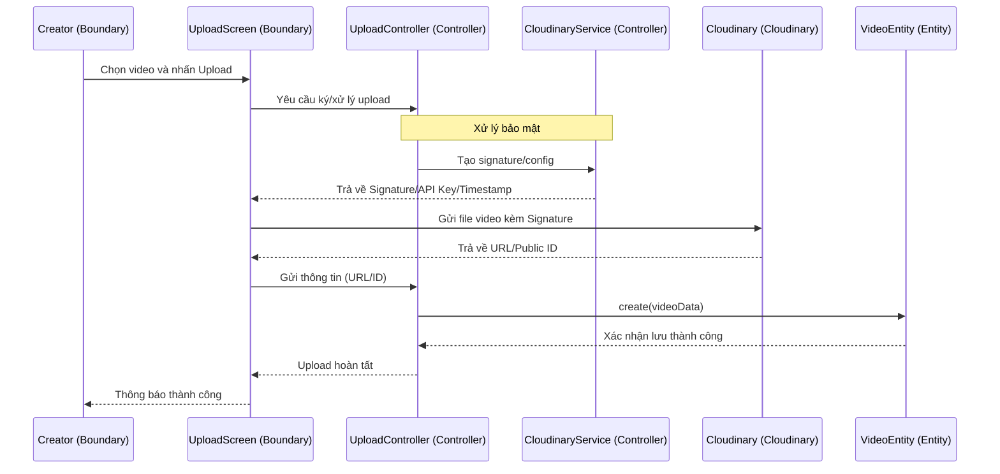

```mermaid
sequenceDiagram
    participant User as Creator (Boundary)
    participant UI as UploadScreen (Boundary)
    participant Ctrl as UploadController (Controller)
    participant Svc as CloudinaryService (Controller)
    participant Cloud as Cloudinary (Cloudinary)
    participant DB as VideoEntity (Entity)

    User->>UI: Chọn video và nhấn Upload
    UI->>Ctrl: Yêu cầu ký/xử lý upload
    
    Note over Ctrl, Svc: Xử lý bảo mật
    Ctrl->>Svc: Tạo signature/config
    Svc-->>UI: Trả về Signature/API Key/Timestamp

    UI->>Cloud: Gửi file video kèm Signature
    Cloud-->>UI: Trả về URL/Public ID

    UI->>Ctrl: Gửi thông tin (URL/ID)
    Ctrl->>DB: create(videoData)
    DB-->>Ctrl: Xác nhận lưu thành công
    Ctrl-->>UI: Upload hoàn tất
    UI-->>User: Thông báo thành công
```
