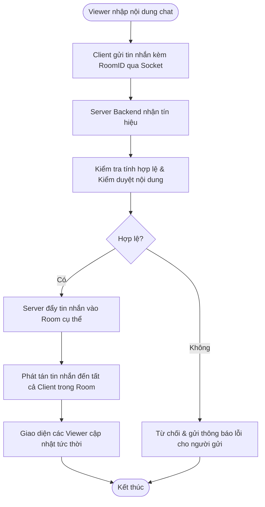

```mermaid
graph TD
    A([Viewer nhập nội dung chat]) --> B[Client gửi tin nhắn kèm RoomID qua Socket]
    B --> C[Server Backend nhận tín hiệu]
    C --> D[Kiểm tra tính hợp lệ & Kiểm duyệt nội dung]
    
    D --> E{Hợp lệ?}
    
    E -- Không --> F[Từ chối & gửi thông báo lỗi cho người gửi]
    E -- Có --> G[Server đẩy tin nhắn vào Room cụ thể]
    
    G --> H[Phát tán tin nhắn đến tất cả Client trong Room]
    H --> I[Giao diện các Viewer cập nhật tức thời]
    I --> J([Kết thúc])
    F --> J
```