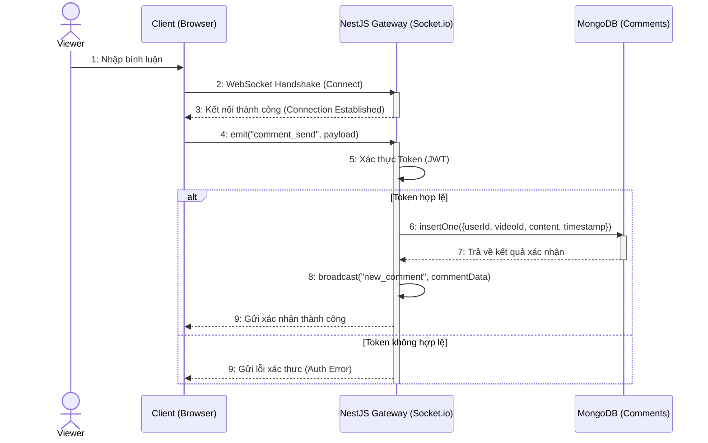

```mermaid
sequenceDiagram
    actor Viewer as Viewer
    participant Client as Client (Browser)
    participant Server as NestJS Gateway (Socket.io)
    participant DB as MongoDB (Comments)

    %% Bước 1: Handshake
    Viewer->>Client: 1: Nhập bình luận
    Client->>Server: 2: WebSocket Handshake (Connect)
    activate Server
    Server-->>Client: 3: Kết nối thành công (Connection Established)
    deactivate Server

    %% Bước 2: Phát sự kiện và lưu trữ
    Client->>Server: 4: emit("comment_send", payload)
    activate Server
    
    Server->>Server: 5: Xác thực Token (JWT)
    
    alt Token hợp lệ
        Server->>DB: 6: insertOne({userId, videoId, content, timestamp})
        activate DB
        DB-->>Server: 7: Trả về kết quả xác nhận
        deactivate DB
        
        Server->>Server: 8: broadcast("new_comment", commentData)
        Server-->>Client: 9: Gửi xác nhận thành công
    else Token không hợp lệ
        Server-->>Client: 9: Gửi lỗi xác thực (Auth Error)
    end
    deactivate Server
```