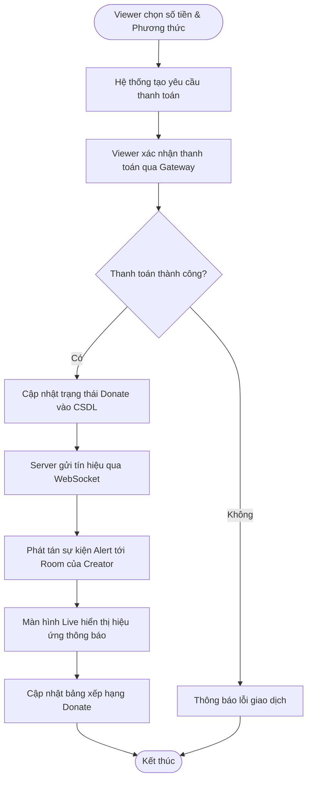

```mermaid
graph TD
    A([Viewer chọn số tiền & Phương thức]) --> B[Hệ thống tạo yêu cầu thanh toán]
    B --> C[Viewer xác nhận thanh toán qua Gateway]
    C --> D{Thanh toán thành công?}
    
    D -- Không --> E[Thông báo lỗi giao dịch]
    D -- Có --> F[Cập nhật trạng thái Donate vào CSDL]
    
    F --> G[Server gửi tín hiệu qua WebSocket]
    G --> H[Phát tán sự kiện Alert tới Room của Creator]
    
    H --> I[Màn hình Live hiển thị hiệu ứng thông báo]
    I --> J[Cập nhật bảng xếp hạng Donate]
    J --> K([Kết thúc])
    E --> K
```