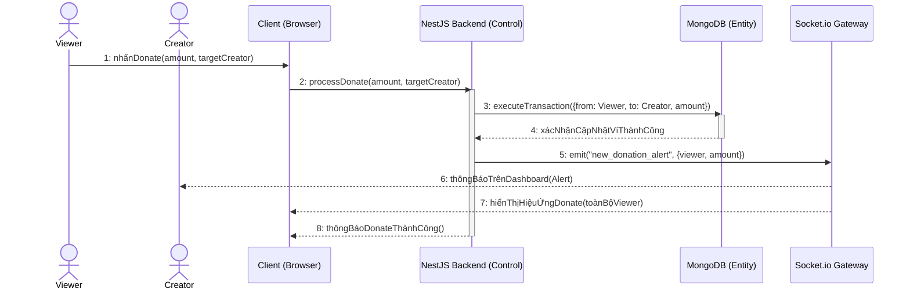

```mermaid
sequenceDiagram
    actor Viewer as Viewer
    actor Creator as Creator
    participant UI as Client (Browser)
    participant Server as NestJS Backend (Control)
    participant DB as MongoDB (Entity)
    participant Socket as Socket.io Gateway

    %% Bước 1: Gửi yêu cầu Donate
    Viewer->>UI: 1: nhấnDonate(amount, targetCreator)
    UI->>Server: 2: processDonate(amount, targetCreator)
    activate Server
    
    %% Bước 2: Xử lý giao dịch tài chính
    Server->>DB: 3: executeTransaction({from: Viewer, to: Creator, amount})
    activate DB
    DB-->>Server: 4: xácNhậnCậpNhậtVíThànhCông
    deactivate DB
    
    %% Bước 3: Phát tín hiệu Real-time
    Server->>Socket: 5: emit("new_donation_alert", {viewer, amount})
    Socket-->>Creator: 6: thôngBáoTrênDashboard(Alert)
    Socket-->>UI: 7: hiểnThịHiệuỨngDonate(toànBộViewer)
    
    Server-->>UI: 8: thôngBáoDonateThànhCông()
    deactivate Server
```