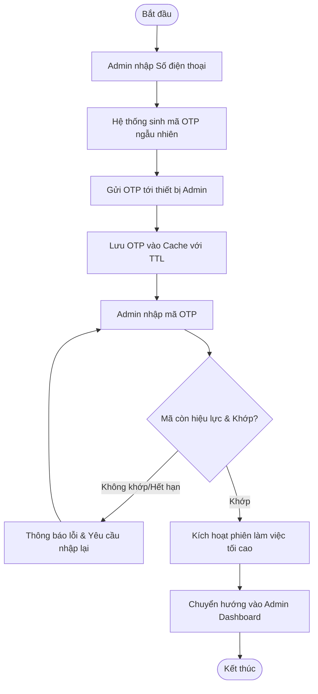

```mermaid
graph TD
    A([Bắt đầu]) --> B[Admin nhập Số điện thoại]
    B --> C[Hệ thống sinh mã OTP ngẫu nhiên]
    C --> D[Gửi OTP tới thiết bị Admin]
    D --> E[Lưu OTP vào Cache với TTL]
    
    E --> F[Admin nhập mã OTP]
    F --> G{Mã còn hiệu lực & Khớp?}
    
    G -- Không khớp/Hết hạn --> H[Thông báo lỗi & Yêu cầu nhập lại]
    H --> F
    
    G -- Khớp --> I[Kích hoạt phiên làm việc tối cao]
    I --> J[Chuyển hướng vào Admin Dashboard]
    J --> K([Kết thúc])
```