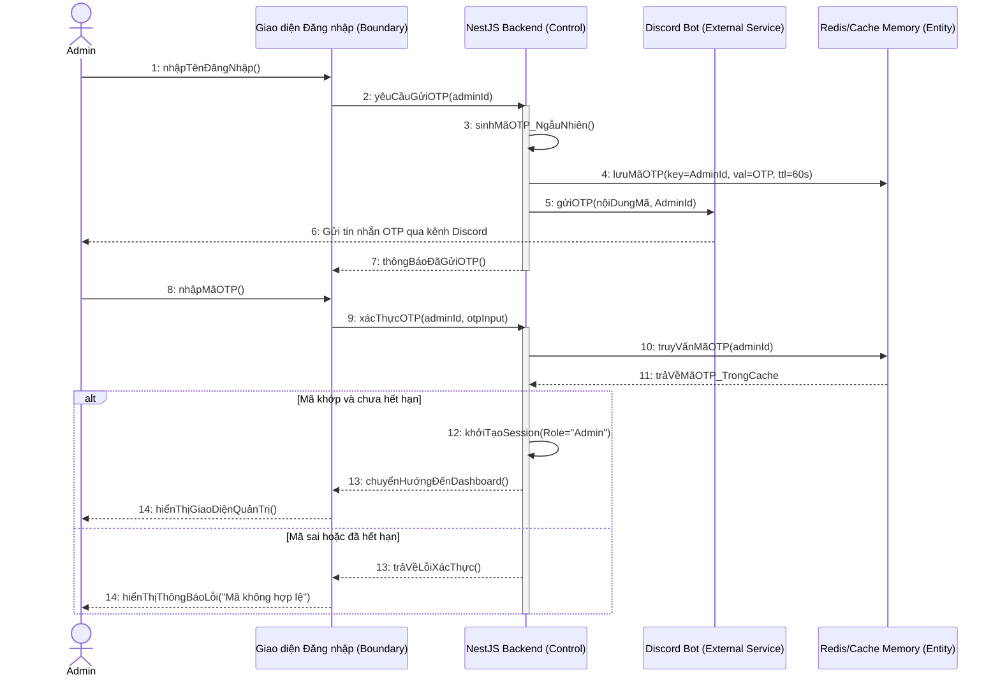

```mermaid
sequenceDiagram
    actor Admin as Admin
    participant UI as Giao diện Đăng nhập (Boundary)
    participant Server as NestJS Backend (Control)
    participant Discord as Discord Bot (External Service)
    participant Cache as Redis/Cache Memory (Entity)

    %% Bước 1: Yêu cầu và gửi OTP qua Discord
    Admin->>UI: 1: nhậpTênĐăngNhập()
    UI->>Server: 2: yêuCầuGửiOTP(adminId)
    activate Server
    Server->>Server: 3: sinhMãOTP_NgẫuNhiên()
    Server->>Cache: 4: lưuMãOTP(key=AdminId, val=OTP, ttl=60s)
    Server->>Discord: 5: gửiOTP(nộiDungMã, AdminId)
    Discord-->>Admin: 6: Gửi tin nhắn OTP qua kênh Discord
    Server-->>UI: 7: thôngBáoĐãGửiOTP()
    deactivate Server

    %% Bước 2: Đối soát OTP
    Admin->>UI: 8: nhậpMãOTP()
    UI->>Server: 9: xácThựcOTP(adminId, otpInput)
    activate Server
    Server->>Cache: 10: truyVấnMãOTP(adminId)
    Cache-->>Server: 11: trảVềMãOTP_TrongCache
    
    alt Mã khớp và chưa hết hạn
        Server->>Server: 12: khởiTạoSession(Role="Admin")
        Server-->>UI: 13: chuyểnHướngĐếnDashboard()
        UI-->>Admin: 14: hiểnThịGiaoDiệnQuảnTrị()
    else Mã sai hoặc đã hết hạn
        Server-->>UI: 13: trảVềLỗiXácThực()
        UI-->>Admin: 14: hiểnThịThôngBáoLỗi("Mã không hợp lệ")
    end
    deactivate Server
```