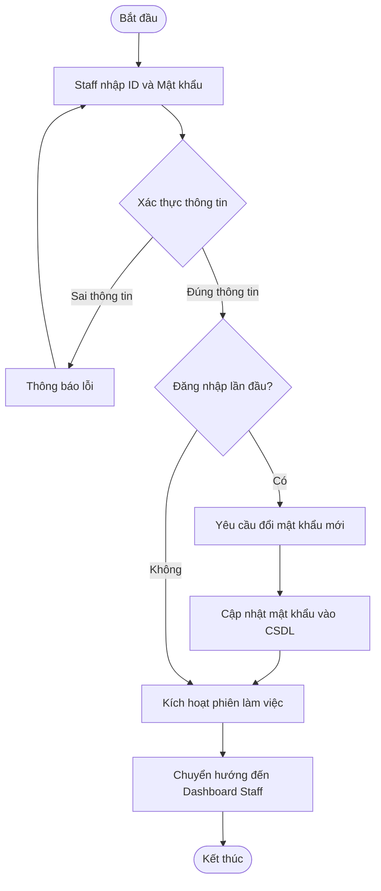

```mermaid
graph TD
    A([Bắt đầu]) --> B[Staff nhập ID và Mật khẩu]
    B --> C{Xác thực thông tin}
    
    C -- Sai thông tin --> D[Thông báo lỗi]
    D --> B
    
    C -- Đúng thông tin --> E{Đăng nhập lần đầu?}
    
    E -- Có --> F[Yêu cầu đổi mật khẩu mới]
    F --> G[Cập nhật mật khẩu vào CSDL]
    G --> H[Kích hoạt phiên làm việc]
    
    E -- Không --> H
    
    H --> I[Chuyển hướng đến Dashboard Staff]
    I --> J([Kết thúc])
```