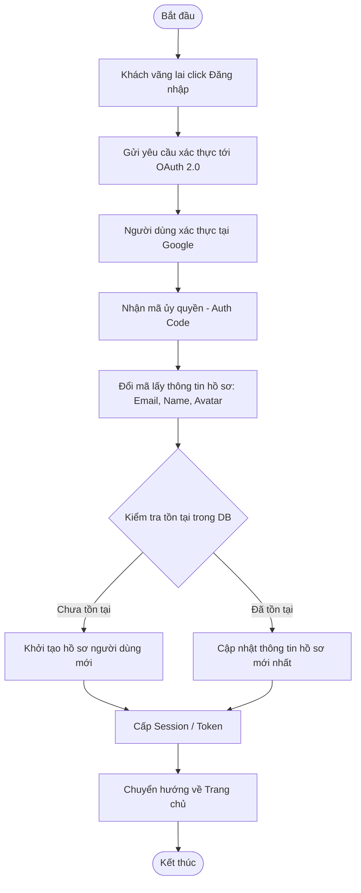

```mermaid
graph TD
    A([Bắt đầu]) --> B[Khách vãng lai click Đăng nhập]
    B --> C[Gửi yêu cầu xác thực tới OAuth 2.0]
    C --> D[Người dùng xác thực tại Google]
    D --> E[Nhận mã ủy quyền - Auth Code]
    E --> F[Đổi mã lấy thông tin hồ sơ: Email, Name, Avatar]
    F --> G{Kiểm tra tồn tại trong DB}
    
    G -- Chưa tồn tại --> H[Khởi tạo hồ sơ người dùng mới]
    G -- Đã tồn tại --> I[Cập nhật thông tin hồ sơ mới nhất]
    
    H --> J[Cấp Session / Token]
    I --> J
    J --> K[Chuyển hướng về Trang chủ]
    K --> L([Kết thúc])
```