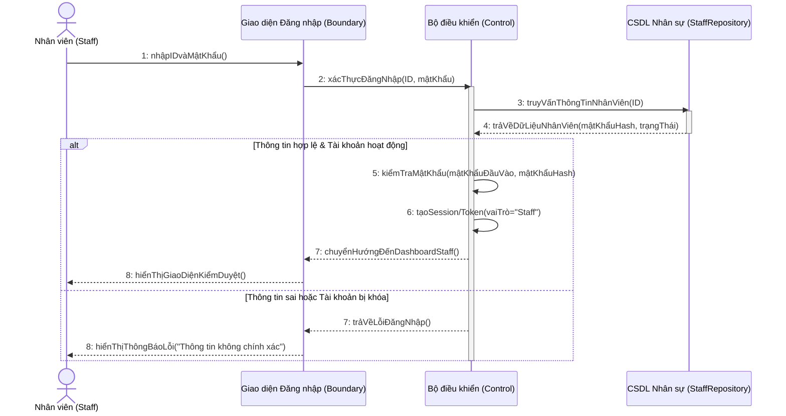

```mermaid
sequenceDiagram
    actor Staff as Nhân viên (Staff)
    participant UI as Giao diện Đăng nhập (Boundary)
    participant Control as Bộ điều khiển (Control)
    participant DB as CSDL Nhân sự (StaffRepository)

    Staff->>UI: 1: nhậpIDvàMậtKhẩu()
    UI->>Control: 2: xácThựcĐăngNhập(ID, mậtKhẩu)
    activate Control

    Control->>DB: 3: truyVấnThôngTinNhânViên(ID)
    activate DB
    DB-->>Control: 4: trảVềDữLiệuNhânViên(mậtKhẩuHash, trạngThái)
    deactivate DB

    alt Thông tin hợp lệ & Tài khoản hoạt động
        Control->>Control: 5: kiểmTraMậtKhẩu(mậtKhẩuĐầuVào, mậtKhẩuHash)
        Control->>Control: 6: tạoSession/Token(vaiTrò="Staff")
        Control-->>UI: 7: chuyểnHướngĐếnDashboardStaff()
        UI-->>Staff: 8: hiểnThịGiaoDiệnKiểmDuyệt()
    else Thông tin sai hoặc Tài khoản bị khóa
        Control-->>UI: 7: trảVềLỗiĐăngNhập()
        UI-->>Staff: 8: hiểnThịThôngBáoLỗi("Thông tin không chính xác")
    end
    deactivate Control
```
