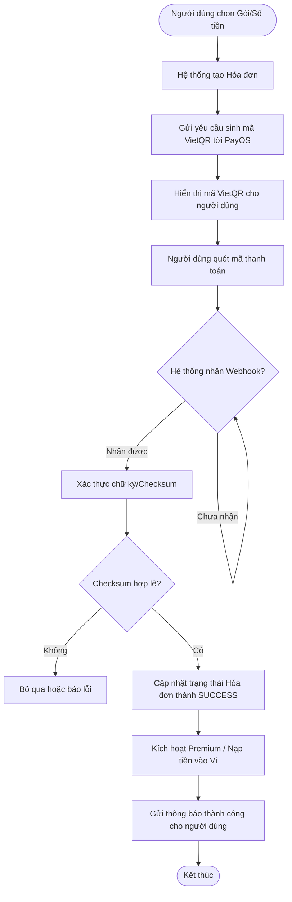

```mermaid
graph TD
    A([Người dùng chọn Gói/Số tiền]) --> B[Hệ thống tạo Hóa đơn]
    B --> C[Gửi yêu cầu sinh mã VietQR tới PayOS]
    C --> D[Hiển thị mã VietQR cho người dùng]
    D --> E[Người dùng quét mã thanh toán]
    
    E --> F{Hệ thống nhận Webhook?}
    
    F -- Chưa nhận --> F
    F -- Nhận được --> G[Xác thực chữ ký/Checksum]
    
    G --> H{Checksum hợp lệ?}
    
    H -- Không --> I[Bỏ qua hoặc báo lỗi]
    H -- Có --> J[Cập nhật trạng thái Hóa đơn thành SUCCESS]
    
    J --> K[Kích hoạt Premium / Nạp tiền vào Ví]
    K --> L[Gửi thông báo thành công cho người dùng]
    L --> M([Kết thúc])
```