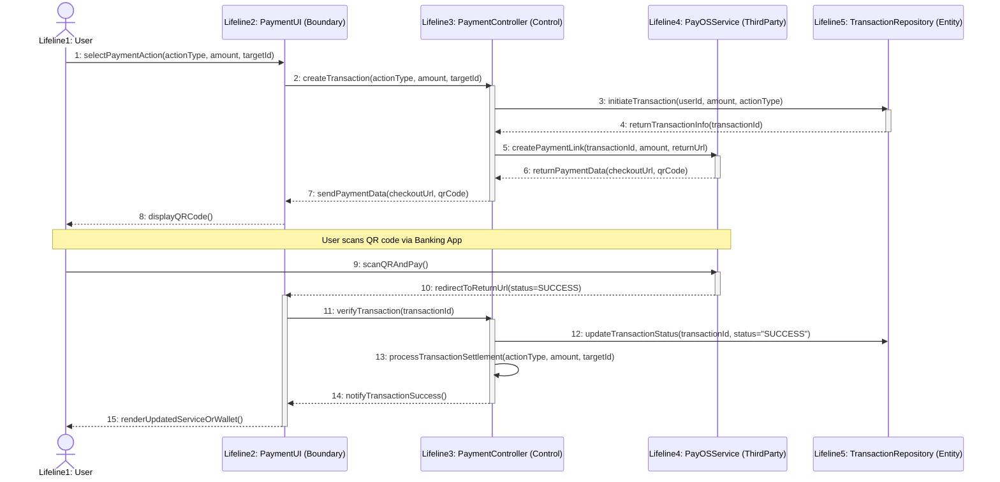

```mermaid
sequenceDiagram
    actor User as Lifeline1: User
    participant UI as Lifeline2: PaymentUI (Boundary)
    participant Control as Lifeline3: PaymentController (Control)
    participant PayOS as Lifeline4: PayOSService (ThirdParty)
    participant DB as Lifeline5: TransactionRepository (Entity)

    %% Initialize General Transaction
    User->>UI: 1: selectPaymentAction(actionType, amount, targetId)
    UI->>Control: 2: createTransaction(actionType, amount, targetId)
    activate Control
    
    Control->>DB: 3: initiateTransaction(userId, amount, actionType)
    activate DB
    DB-->>Control: 4: returnTransactionInfo(transactionId)
    deactivate DB

    %% Interact with PayOS Gateway
    Control->>PayOS: 5: createPaymentLink(transactionId, amount, returnUrl)
    activate PayOS
    PayOS-->>Control: 6: returnPaymentData(checkoutUrl, qrCode)
    deactivate PayOS

    Control-->>UI: 7: sendPaymentData(checkoutUrl, qrCode)
    deactivate Control
    UI-->>User: 8: displayQRCode()

    %% Payment Execution and Redirection
    Note over User, PayOS: User scans QR code via Banking App
    User->>PayOS: 9: scanQRAndPay()
    activate PayOS
    PayOS-->>UI: 10: redirectToReturnUrl(status=SUCCESS)
    deactivate PayOS

    %% Verify and Settle Transaction
    activate UI
    UI->>Control: 11: verifyTransaction(transactionId)
    activate Control
    Control->>DB: 12: updateTransactionStatus(transactionId, status="SUCCESS")
    
    %% Internal call to dispatch wallet top-up, premium activation, or video unlock
    Control->>Control: 13: processTransactionSettlement(actionType, amount, targetId)
    
    Control-->>UI: 14: notifyTransactionSuccess()
    deactivate Control
    
    UI-->>User: 15: renderUpdatedServiceOrWallet()
    deactivate UI
```