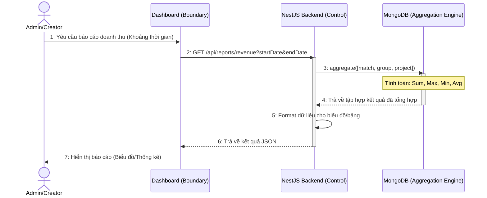

```mermaid
sequenceDiagram
    actor Admin as Admin/Creator
    participant UI as Dashboard (Boundary)
    participant Server as NestJS Backend (Control)
    participant DB as MongoDB (Aggregation Engine)

    %% Bước 1: Yêu cầu báo cáo
    Admin->>UI: 1: Yêu cầu báo cáo doanh thu (Khoảng thời gian)
    UI->>Server: 2: GET /api/reports/revenue?startDate&endDate
    activate Server
    
    %% Bước 2: Thực hiện Aggregation Pipeline
    Server->>DB: 3: aggregate([match, group, project])
    activate DB
    Note over DB: Tính toán: Sum, Max, Min, Avg
    DB-->>Server: 4: Trả về tập hợp kết quả đã tổng hợp
    deactivate DB
    
    %% Bước 3: Định dạng và hiển thị
    Server->>Server: 5: Format dữ liệu cho biểu đồ/bảng
    Server-->>UI: 6: Trả về kết quả JSON
    deactivate Server
    
    UI-->>Admin: 7: Hiển thị báo cáo (Biểu đồ/Thống kê)
```