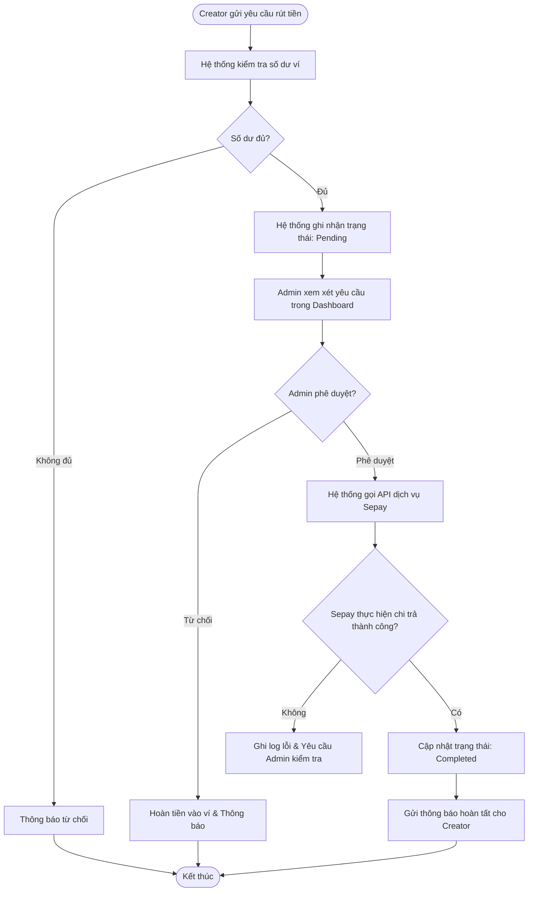

```mermaid
graph TD
    A([Creator gửi yêu cầu rút tiền]) --> B[Hệ thống kiểm tra số dư ví]
    B --> C{Số dư đủ?}
    
    C -- Không đủ --> D[Thông báo từ chối]
    C -- Đủ --> E[Hệ thống ghi nhận trạng thái: Pending]
    
    E --> F[Admin xem xét yêu cầu trong Dashboard]
    F --> G{Admin phê duyệt?}
    
    G -- Từ chối --> H[Hoàn tiền vào ví & Thông báo]
    G -- Phê duyệt --> I[Hệ thống gọi API dịch vụ Sepay]
    
    I --> J{Sepay thực hiện chi trả thành công?}
    
    J -- Không --> K[Ghi log lỗi & Yêu cầu Admin kiểm tra]
    J -- Có --> L[Cập nhật trạng thái: Completed]
    
    L --> M[Gửi thông báo hoàn tất cho Creator]
    H --> N([Kết thúc])
    M --> N
    D --> N
```