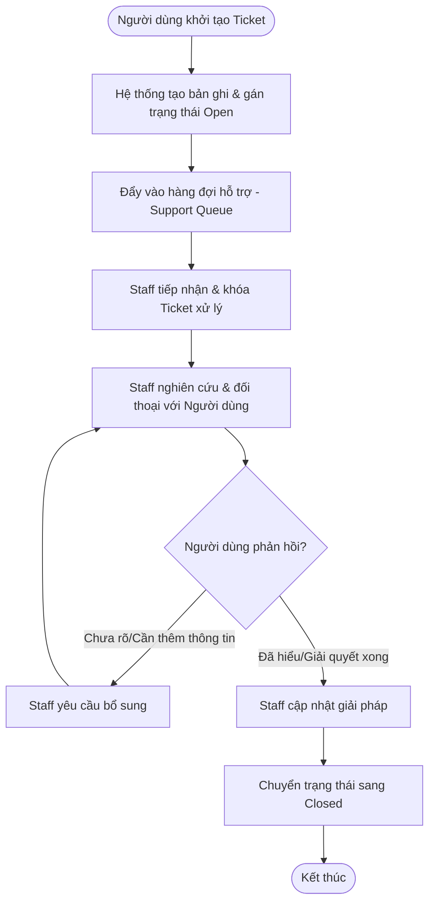

```mermaid
graph TD
    A([Người dùng khởi tạo Ticket]) --> B[Hệ thống tạo bản ghi & gán trạng thái Open]
    B --> C[Đẩy vào hàng đợi hỗ trợ - Support Queue]
    C --> D[Staff tiếp nhận & khóa Ticket xử lý]
    
    D --> E[Staff nghiên cứu & đối thoại với Người dùng]
    E --> F{Người dùng phản hồi?}
    
    F -- Chưa rõ/Cần thêm thông tin --> G[Staff yêu cầu bổ sung]
    G --> E
    
    F -- Đã hiểu/Giải quyết xong --> H[Staff cập nhật giải pháp]
    H --> I[Chuyển trạng thái sang Closed]
    I --> J([Kết thúc])
```