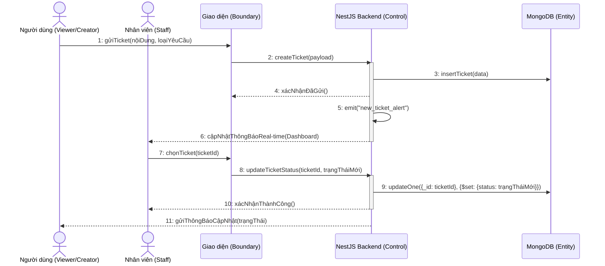

```mermaid
sequenceDiagram
    actor User as Người dùng (Viewer/Creator)
    actor Staff as Nhân viên (Staff)
    participant UI as Giao diện (Boundary)
    participant Server as NestJS Backend (Control)
    participant DB as MongoDB (Entity)

    %% Bước 1: Người dùng gửi yêu cầu
    User->>UI: 1: gửiTicket(nộiDung, loạiYêuCầu)
    UI->>Server: 2: createTicket(payload)
    activate Server
    Server->>DB: 3: insertTicket(data)
    Server-->>UI: 4: xácNhậnĐãGửi()
    
    %% Bước 2: Thông báo Real-time sang Staff
    Server->>Server: 5: emit("new_ticket_alert")
    Server-->>Staff: 6: cậpNhậtThôngBáoReal-time(Dashboard)
    deactivate Server

    %% Bước 3: Staff xử lý và cập nhật trạng thái
    Staff->>UI: 7: chọnTicket(ticketId)
    UI->>Server: 8: updateTicketStatus(ticketId, trạngTháiMới)
    activate Server
    Server->>DB: 9: updateOne({_id: ticketId}, {$set: {status: trạngTháiMới}})
    Server-->>Staff: 10: xácNhậnThànhCông()
    deactivate Server
    
    %% Bước 4: Thông báo lại cho người dùng
    Server-->>User: 11: gửiThôngBáoCậpNhật(trạngThái)
```