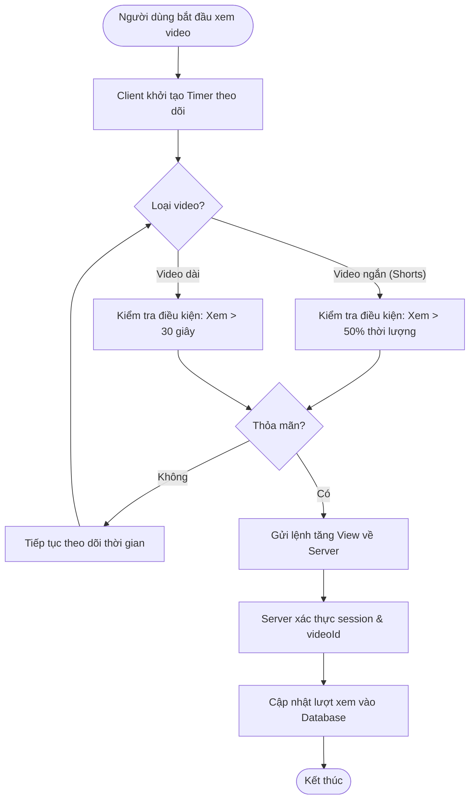

```mermaid
graph TD
    A([Người dùng bắt đầu xem video]) --> B[Client khởi tạo Timer theo dõi]
    B --> C{Loại video?}
    
    C -- Video ngắn (Shorts) --> D[Kiểm tra điều kiện: Xem > 50% thời lượng]
    C -- Video dài --> E[Kiểm tra điều kiện: Xem > 30 giây]
    
    D --> F{Thỏa mãn?}
    E --> F
    
    F -- Không --> G[Tiếp tục theo dõi thời gian]
    G --> C
    
    F -- Có --> H[Gửi lệnh tăng View về Server]
    H --> I[Server xác thực session & videoId]
    I --> J[Cập nhật lượt xem vào Database]
    J --> K([Kết thúc])
```