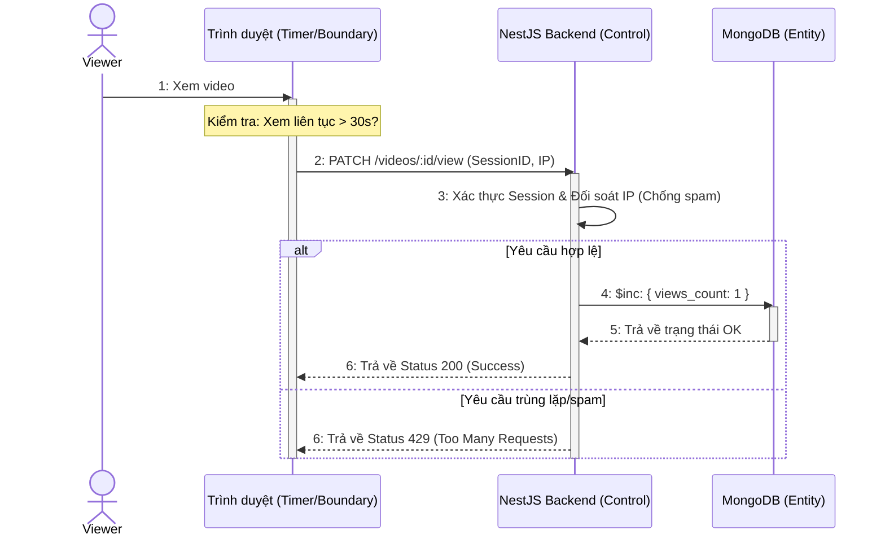

```mermaid
sequenceDiagram
    actor Viewer as Viewer
    participant Browser as Trình duyệt (Timer/Boundary)
    participant Server as NestJS Backend (Control)
    participant DB as MongoDB (Entity)

    %% Bước 1: Timer kiểm tra điều kiện
    Viewer->>Browser: 1: Xem video
    activate Browser
    Note over Browser: Kiểm tra: Xem liên tục > 30s?
    
    %% Bước 2: Gửi yêu cầu cập nhật ngầm
    Browser->>Server: 2: PATCH /videos/:id/view (SessionID, IP)
    activate Server
    
    %% Bước 3: Đối soát và cập nhật
    Server->>Server: 3: Xác thực Session & Đối soát IP (Chống spam)
    
    alt Yêu cầu hợp lệ
        Server->>DB: 4: $inc: { views_count: 1 }
        activate DB
        DB-->>Server: 5: Trả về trạng thái OK
        deactivate DB
        Server-->>Browser: 6: Trả về Status 200 (Success)
    else Yêu cầu trùng lặp/spam
        Server-->>Browser: 6: Trả về Status 429 (Too Many Requests)
    end
    deactivate Server
    deactivate Browser
```