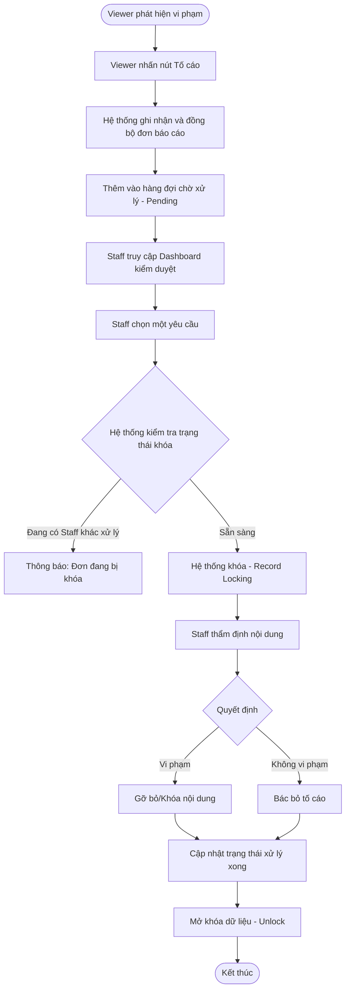

```mermaid
graph TD
    A([Viewer phát hiện vi phạm]) --> B[Viewer nhấn nút Tố cáo]
    B --> C[Hệ thống ghi nhận và đồng bộ đơn báo cáo]
    C --> D[Thêm vào hàng đợi chờ xử lý - Pending]
    
    %% Luồng xử lý của Staff
    D --> E[Staff truy cập Dashboard kiểm duyệt]
    E --> F[Staff chọn một yêu cầu]
    
    %% Cơ chế khóa dữ liệu
    F --> G{Hệ thống kiểm tra trạng thái khóa}
    G -- Đang có Staff khác xử lý --> H[Thông báo: Đơn đang bị khóa]
    G -- Sẵn sàng --> I[Hệ thống khóa - Record Locking]
    
    I --> J[Staff thẩm định nội dung]
    J --> K{Quyết định}
    
    K -- Vi phạm --> L[Gỡ bỏ/Khóa nội dung]
    K -- Không vi phạm --> M[Bác bỏ tố cáo]
    
    L --> N[Cập nhật trạng thái xử lý xong]
    M --> N
    N --> O[Mở khóa dữ liệu - Unlock]
    O --> P([Kết thúc])
```