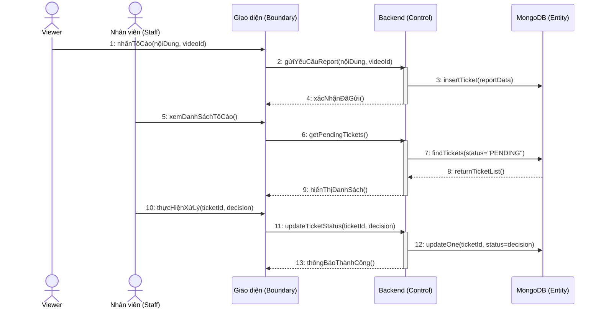

```mermaid
sequenceDiagram
    %% Khai báo Actor nằm hết về bên trái theo thứ tự
    actor Viewer as Viewer
    actor Staff as Nhân viên (Staff)
    
    %% Các thành phần khác nằm bên phải
    participant UI as Giao diện (Boundary)
    participant Server as Backend (Control)
    participant DB as MongoDB (Entity)

    %% Luồng Viewer gửi tố cáo
    Viewer->>UI: 1: nhấnTốCáo(nộiDung, videoId)
    UI->>Server: 2: gửiYêuCầuReport(nộiDung, videoId)
    activate Server
    Server->>DB: 3: insertTicket(reportData)
    Server-->>UI: 4: xácNhậnĐãGửi()
    deactivate Server

    %% Luồng Staff xử lý
    Staff->>UI: 5: xemDanhSáchTốCáo()
    UI->>Server: 6: getPendingTickets()
    activate Server
    Server->>DB: 7: findTickets(status="PENDING")
    DB-->>Server: 8: returnTicketList()
    Server-->>UI: 9: hiểnThịDanhSách()
    deactivate Server

    Staff->>UI: 10: thựcHiệnXửLý(ticketId, decision)
    UI->>Server: 11: updateTicketStatus(ticketId, decision)
    activate Server
    Server->>DB: 12: updateOne(ticketId, status=decision)
    Server-->>UI: 13: thôngBáoThànhCông()
    deactivate Server
```