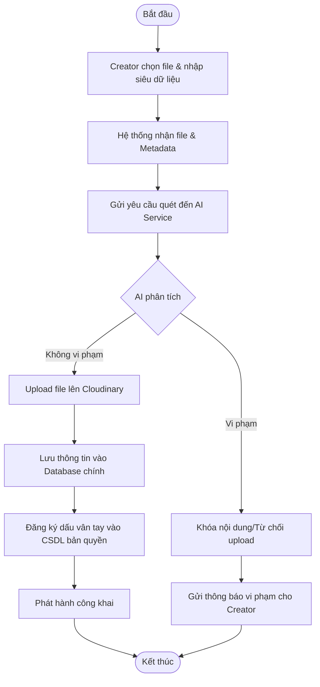

```mermaid
graph TD
    A([Bắt đầu]) --> B[Creator chọn file & nhập siêu dữ liệu]
    B --> C[Hệ thống nhận file & Metadata]
    C --> D[Gửi yêu cầu quét đến AI Service]
    
    D --> E{AI phân tích}
    
    E -- Không vi phạm --> F[Upload file lên Cloudinary]
    F --> G[Lưu thông tin vào Database chính]
    G --> H[Đăng ký dấu vân tay vào CSDL bản quyền]
    H --> I[Phát hành công khai]
    
    E -- Vi phạm --> J[Khóa nội dung/Từ chối upload]
    J --> K[Gửi thông báo vi phạm cho Creator]
    
    I --> L([Kết thúc])
    K --> L
```