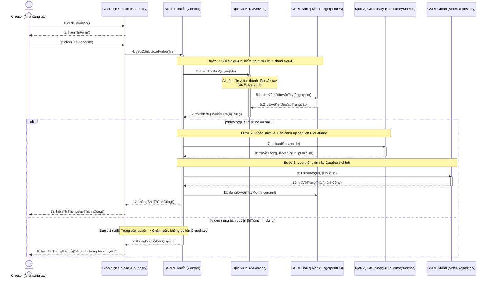

```mermaid
sequenceDiagram
    actor Creator as Creator (Nhà sáng tạo)
    participant Boundary1 as Giao diện Upload (Boundary)
    participant Control1 as Bộ điều khiển (Control)
    participant AI as Dịch vụ AI (AIService)
    participant FPDB as CSDL Bản quyền (FingerprintDB)
    participant Cloudinary as Dịch vụ Cloudinary (CloudinaryService)
    participant DB as CSDL Chính (VideoRepository)

    Creator->>Boundary1: 1: clickTảiVideo()
    Boundary1-->>Creator: 2: hiểnThịForm()
    Creator->>Boundary1: 3: chọnFileVideo(file)
    Boundary1->>Control1: 4: yêuCầuUploadVideo(file)
    activate Control1
    
    %% BƯỚC 1: KIỂM TRA BẢN QUYỀN TRƯỚC
    Note over Control1, FPDB: Bước 1: Gửi file qua AI kiểm tra trước khi upload cloud
    Control1->>AI: 5: kiểmTraBảnQuyền(file)
    activate AI
    Note over AI: AI băm file video thành dấu vân tay<br/>(tạoFingerprint)
    AI->>FPDB: 5.1: tìmKiếmDấuVânTay(fingerprint)
    activate FPDB
    FPDB-->>AI: 5.2: trảVềKếtQuả(cóTrùngLặp)
    deactivate FPDB
    AI-->>Control1: 6: trảVềKếtQuảKiểmTra(bịTrùng)
    deactivate AI

    %% BƯỚC 2: RẼ NHÁNH ĐIỀU KIỆN
    alt Video hợp lệ [bịTrùng == sai]
        Note over Control1, Cloudinary: Bước 2: Video sạch -> Tiến hành upload lên Cloudinary
        Control1->>Cloudinary: 7: uploadStream(file)
        activate Cloudinary
        Cloudinary-->>Control1: 8: trảVềThôngTinMedia(url, public_id)
        deactivate Cloudinary

        Note over Control1, DB: Bước 3: Lưu thông tin vào Database chính
        Control1->>DB: 9: lưuVideo(url, public_id)
        activate DB
        DB-->>Control1: 10: trảVềTrạngThái(thànhCông)
        deactivate DB
        
        %% Cập nhật vân tay của video mới vào kho bản quyền để người sau không trùng được nữa
        Control1->>FPDB: 11: đăngKýVânTayMới(fingerprint)
        
        Control1-->>Boundary1: 12: thôngBáoThànhCông()
        Boundary1-->>Creator: 13: hiểnThịThôngBáoThànhCông()

    else Video trùng bản quyền [bịTrùng == đúng]
        Note over Control1, Boundary1: Bước 2 (Lỗi): Trùng bản quyền -> Chặn luôn, không up lên Cloudinary
        Control1-->>Boundary1: 7: thôngBáoLỗiBảnQuyền()
        deactivate Control1
        Boundary1-->>Creator: 8: hiểnThịThôngBáoLỗi("Video bị trùng bản quyền!")
    end
```