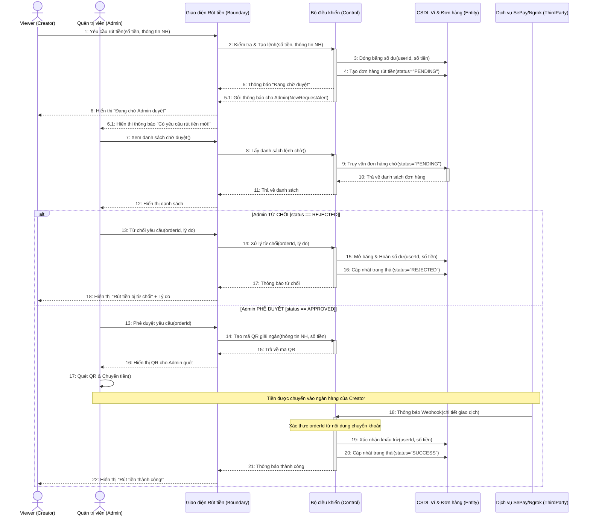

```mermaid
sequenceDiagram
    actor Viewer as Viewer (Creator)
    actor Admin as Quản trị viên (Admin)
    participant UI as Giao diện Rút tiền (Boundary)
    participant Control as Bộ điều khiển (Control)
    participant DB as CSDL Ví & Đơn hàng (Entity)
    participant SePay as Dịch vụ SePay/Ngrok (ThirdParty)

    %% Bước 1: Yêu cầu rút tiền
    Viewer->>UI: 1: Yêu cầu rút tiền(số tiền, thông tin NH)
    UI->>Control: 2: Kiểm tra & Tạo lệnh(số tiền, thông tin NH)
    activate Control
    
    %% Đóng băng số dư ngay lập tức
    Control->>DB: 3: Đóng băng số dư(userId, số tiền)
    Control->>DB: 4: Tạo đơn hàng rút tiền(status="PENDING")
    
    %% Gửi phản hồi cho Creator đồng thời bắn thông báo cho Admin
    Control-->>UI: 5: Thông báo "Đang chờ duyệt"
    Control-->>UI: 5.1: Gửi thông báo cho Admin(NewRequestAlert)
    deactivate Control
    
    UI-->>Viewer: 6: Hiển thị "Đang chờ Admin duyệt"
    UI-->>Admin: 6.1: Hiển thị thông báo "Có yêu cầu rút tiền mới!"

    %% Bước 2: Admin xử lý
    Admin->>UI: 7: Xem danh sách chờ duyệt()
    UI->>Control: 8: Lấy danh sách lệnh chờ()
    activate Control
    Control->>DB: 9: Truy vấn đơn hàng chờ(status="PENDING")
    activate DB
    DB-->>Control: 10: Trả về danh sách đơn hàng
    deactivate DB
    Control-->>UI: 11: Trả về danh sách
    deactivate Control
    UI-->>Admin: 12: Hiển thị danh sách

    alt Admin TỪ CHỐI [status == REJECTED]
        Admin->>UI: 13: Từ chối yêu cầu(orderId, lý do)
        UI->>Control: 14: Xử lý từ chối(orderId, lý do)
        activate Control
        Control->>DB: 15: Mở băng & Hoàn số dư(userId, số tiền)
        Control->>DB: 16: Cập nhật trạng thái(status="REJECTED")
        Control-->>UI: 17: Thông báo từ chối
        deactivate Control
        UI-->>Viewer: 18: Hiển thị "Rút tiền bị từ chối" + Lý do

    else Admin PHÊ DUYỆT [status == APPROVED]
        Admin->>UI: 13: Phê duyệt yêu cầu(orderId)
        UI->>Control: 14: Tạo mã QR giải ngân(thông tin NH, số tiền)
        activate Control
        Control-->>UI: 15: Trả về mã QR
        deactivate Control
        UI-->>Admin: 16: Hiển thị QR cho Admin quét
        
        %% Admin chuyển tiền thủ công
        Admin->>Admin: 17: Quét QR & Chuyển tiền()
        Note over Admin, SePay: Tiền được chuyển vào ngân hàng của Creator
        
        %% SePay Webhook tự động kích hoạt
        SePay->>Control: 18: Thông báo Webhook(chi tiết giao dịch)
        activate Control
        Note over Control: Xác thực orderId từ nội dung chuyển khoản
        Control->>DB: 19: Xác nhận khấu trừ(userId, số tiền)
        Control->>DB: 20: Cập nhật trạng thái(status="SUCCESS")
        Control-->>UI: 21: Thông báo thành công
        deactivate Control
        UI-->>Viewer: 22: Hiển thị "Rút tiền thành công!"
    end
```